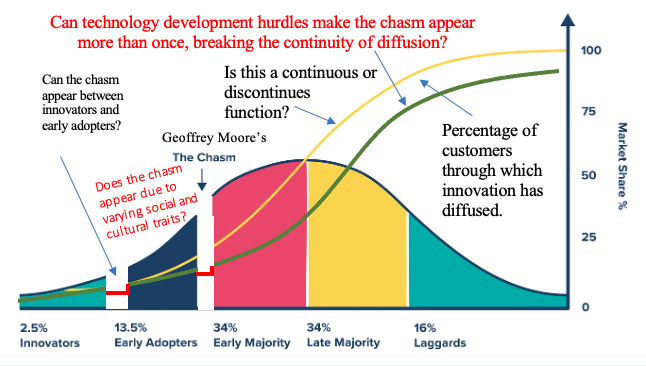

# Diffusion of Innovation

<figure><figcaption>
<a href="https://www.the-waves.org/2023/10/09/crossing-the-chasm-geoffrey-moore-failing-to-explain-reality/">https://www.the-waves.org/2023/10/09/crossing-the-chasm-geoffrey-moore-failing-to-explain-reality/</a>
</figcaption></figure>

Diffusion of innovations is a theory that explains how, why, and at what rate new ideas and technology spread through a population. It describes the process by which an innovation is communicated through specific channels over time among members of a social system. This theory is often used to understand how new products, services, or processes are adopted by their intended audiences. Key Concepts:

* **Innovation:**&#x41; new idea, practice, or product that is perceived as new by an individual or other unit of adoption.&#x20;
* **Diffusion:**&#x54;he process by which an innovation is communicated through channels over time among members of a social system.&#x20;
* [**Adopter Categories**](https://www.google.com/search?sca_esv=0341e61adf0435df\&rlz=1C5CHFA_enSG951SG953\&sxsrf=AE3TifNvv3V4gaFSsbM-ABvr9lwwVZRNVg%3A1756733904606\&q=Adopter+Categories\&sa=X\&ved=2ahUKEwiBguXi17ePAxVnRmwGHZCFPRQQxccNegUInQEQAQ\&mstk=AUtExfDcBcq-X4OtSWv316GUb7c0va4TtXVoMgmlQtSqdGsKMRxzsnWrHkWmgv2La01AJUaTS1-6pGclnc6sP_m6dKe-jON_dUKwMLfI3WU2dY81t_94cLRF3puEl3jSKhDw7VaRalG3UJh7lb9Nv7S_-RihGU6feFdsqpb1nb9q8bYahfdEInWeH9u65hby9J7cLBpWvBMpJ_DkxiRo0ByUDoSJbUMG12iDFLubeIVK7xQq6xMbuICwd-e7l57LZgR36T2cWdzvP8J3bae3sAIAs7hF\&csui=3)**:**&#x49;ndividuals or groups are categorized based on their willingness to adopt an innovation: Innovators, Early Adopters, Early Majority, Late Majority, and Laggards.&#x20;
* **Communication Channels:**&#x54;he methods used to spread information about the innovation, such as mass media, interpersonal communication, or online platforms.&#x20;
* **Time:**&#x54;he amount of time it takes for an innovation to be adopted by a population.&#x20;
* **Social System:**&#x54;he group of individuals, organizations, or communities where the innovation is being diffused.&#x20;

Adopter Categories:

* [**Innovators**](https://www.google.com/search?sca_esv=0341e61adf0435df\&rlz=1C5CHFA_enSG951SG953\&sxsrf=AE3TifNvv3V4gaFSsbM-ABvr9lwwVZRNVg%3A1756733904606\&q=Innovators\&sa=X\&ved=2ahUKEwiBguXi17ePAxVnRmwGHZCFPRQQxccNegUIvAEQAQ\&mstk=AUtExfDcBcq-X4OtSWv316GUb7c0va4TtXVoMgmlQtSqdGsKMRxzsnWrHkWmgv2La01AJUaTS1-6pGclnc6sP_m6dKe-jON_dUKwMLfI3WU2dY81t_94cLRF3puEl3jSKhDw7VaRalG3UJh7lb9Nv7S_-RihGU6feFdsqpb1nb9q8bYahfdEInWeH9u65hby9J7cLBpWvBMpJ_DkxiRo0ByUDoSJbUMG12iDFLubeIVK7xQq6xMbuICwd-e7l57LZgR36T2cWdzvP8J3bae3sAIAs7hF\&csui=3)**:**&#x54;he first individuals to adopt an innovation. They are adventurous, risk-taking, and eager to try new things.&#x20;
* [**Early Adopters**](https://www.google.com/search?sca_esv=0341e61adf0435df\&rlz=1C5CHFA_enSG951SG953\&sxsrf=AE3TifNvv3V4gaFSsbM-ABvr9lwwVZRNVg%3A1756733904606\&q=Early+Adopters\&sa=X\&ved=2ahUKEwiBguXi17ePAxVnRmwGHZCFPRQQxccNegUIyQEQAQ\&mstk=AUtExfDcBcq-X4OtSWv316GUb7c0va4TtXVoMgmlQtSqdGsKMRxzsnWrHkWmgv2La01AJUaTS1-6pGclnc6sP_m6dKe-jON_dUKwMLfI3WU2dY81t_94cLRF3puEl3jSKhDw7VaRalG3UJh7lb9Nv7S_-RihGU6feFdsqpb1nb9q8bYahfdEInWeH9u65hby9J7cLBpWvBMpJ_DkxiRo0ByUDoSJbUMG12iDFLubeIVK7xQq6xMbuICwd-e7l57LZgR36T2cWdzvP8J3bae3sAIAs7hF\&csui=3)**:**&#x4F;pinion leaders who adopt an innovation early on. They are respected by their peers and influence others to adopt as well.&#x20;
* [**Early Majority**](https://www.google.com/search?sca_esv=0341e61adf0435df\&rlz=1C5CHFA_enSG951SG953\&sxsrf=AE3TifNvv3V4gaFSsbM-ABvr9lwwVZRNVg%3A1756733904606\&q=Early+Majority\&sa=X\&ved=2ahUKEwiBguXi17ePAxVnRmwGHZCFPRQQxccNegUI7gEQAQ\&mstk=AUtExfDcBcq-X4OtSWv316GUb7c0va4TtXVoMgmlQtSqdGsKMRxzsnWrHkWmgv2La01AJUaTS1-6pGclnc6sP_m6dKe-jON_dUKwMLfI3WU2dY81t_94cLRF3puEl3jSKhDw7VaRalG3UJh7lb9Nv7S_-RihGU6feFdsqpb1nb9q8bYahfdEInWeH9u65hby9J7cLBpWvBMpJ_DkxiRo0ByUDoSJbUMG12iDFLubeIVK7xQq6xMbuICwd-e7l57LZgR36T2cWdzvP8J3bae3sAIAs7hF\&csui=3)**:**&#x49;ndividuals who adopt an innovation after a relatively long period of time. They are deliberate in their decision-making and tend to be more risk-averse than the early adopters.&#x20;
* [**Late Majority**](https://www.google.com/search?sca_esv=0341e61adf0435df\&rlz=1C5CHFA_enSG951SG953\&sxsrf=AE3TifNvv3V4gaFSsbM-ABvr9lwwVZRNVg%3A1756733904606\&q=Late+Majority\&sa=X\&ved=2ahUKEwiBguXi17ePAxVnRmwGHZCFPRQQxccNegUI8AEQAQ\&mstk=AUtExfDcBcq-X4OtSWv316GUb7c0va4TtXVoMgmlQtSqdGsKMRxzsnWrHkWmgv2La01AJUaTS1-6pGclnc6sP_m6dKe-jON_dUKwMLfI3WU2dY81t_94cLRF3puEl3jSKhDw7VaRalG3UJh7lb9Nv7S_-RihGU6feFdsqpb1nb9q8bYahfdEInWeH9u65hby9J7cLBpWvBMpJ_DkxiRo0ByUDoSJbUMG12iDFLubeIVK7xQq6xMbuICwd-e7l57LZgR36T2cWdzvP8J3bae3sAIAs7hF\&csui=3)**:**&#x49;ndividuals who adopt an innovation after the majority of the population has already done so. They are skeptical of change and often adopt due to social pressure or necessity.&#x20;
* [**Laggards**](https://www.google.com/search?sca_esv=0341e61adf0435df\&rlz=1C5CHFA_enSG951SG953\&sxsrf=AE3TifNvv3V4gaFSsbM-ABvr9lwwVZRNVg%3A1756733904606\&q=Laggards\&sa=X\&ved=2ahUKEwiBguXi17ePAxVnRmwGHZCFPRQQxccNegUI-AEQAQ\&mstk=AUtExfDcBcq-X4OtSWv316GUb7c0va4TtXVoMgmlQtSqdGsKMRxzsnWrHkWmgv2La01AJUaTS1-6pGclnc6sP_m6dKe-jON_dUKwMLfI3WU2dY81t_94cLRF3puEl3jSKhDw7VaRalG3UJh7lb9Nv7S_-RihGU6feFdsqpb1nb9q8bYahfdEInWeH9u65hby9J7cLBpWvBMpJ_DkxiRo0ByUDoSJbUMG12iDFLubeIVK7xQq6xMbuICwd-e7l57LZgR36T2cWdzvP8J3bae3sAIAs7hF\&csui=3)**:**&#x54;he last individuals to adopt an innovation. They are resistant to change and may never adopt the innovation.&#x20;

Factors Influencing Diffusion:

* **Relative Advantage:** The extent to which an innovation is perceived as better than what it replaces.&#x20;
* **Compatibility:** The degree to which an innovation is consistent with existing values, needs, and past experiences of potential adopters.&#x20;
* **Complexity:** The perceived difficulty of understanding and using an innovation.&#x20;
* **Trialability:** The extent to which an innovation can be experimented with on a limited basis before adoption.&#x20;
* **Observability:** The degree to which the results of an innovation are visible to others.&#x20;

Example:Consider the adoption of a new smartphone. Innovators might be the first to purchase the latest model, followed by early adopters who see its potential. The early majority will then adopt it as more reviews and social proof emerge. The late majority may adopt it due to its widespread popularity, while laggards might stick with their older phones or be the last to adopt a new phone altogether.&#x20;

<figure><figcaption></figcaption></figure>
