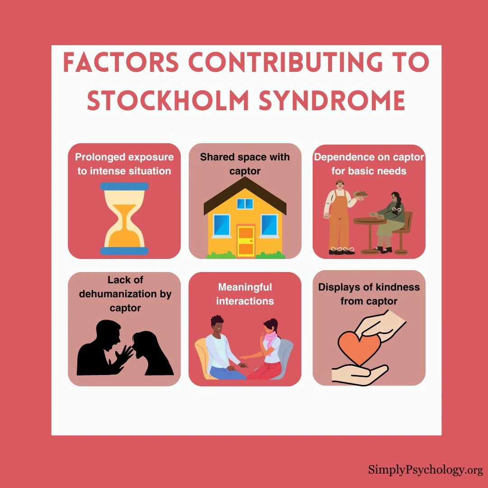

# Stockholm Syndrome

<figure><figcaption>
<a href="https://www.simplypsychology.org/stockholm-syndrome.html">https://www.simplypsychology.org/stockholm-syndrome.html</a>
</figcaption></figure>

Stockholm syndrome is a psychological response in which a captive develops positive feelings, such as sympathy and loyalty, for their captor or abuser, often as a survival mechanism to reduce threat and increase chances of survival. The term originated after a 1973 bank robbery in Stockholm, Sweden, where hostages bonded with their captors and even defended them after their release. Key symptoms include sympathy for the aggressor, emotional attachment to them, negative feelings toward outside help, and a sense of isolation from the world. While it appears to be a coping strategy for victims in terrifying situations, it is relatively rare. 

Origin of the Term&#x20;

The term was coined after a 1973 bank robbery in Stockholm, Sweden, where bank employees were held captive for six days. During the ordeal, the captives developed an attachment to their captors and expressed fear and distrust toward the police. Some captives even defended their captors after being released and declined to testify against them. Key Characteristics

* **Sympathy for the aggressor:**&#x56;ictims may develop empathy for their captor and even justify their actions.&#x20;
* **Emotional attachment:**&#x41; strong bond can form, arising from the feeling that the attacker provides protection or understanding.&#x20;
* **Negative feelings toward authorities:**&#x56;ictims may distrust police or government agencies and resent offers of rescue from the outside world.&#x20;
* **Feeling of isolation:**&#x54;he victim may feel that only the aggressor understands them, leading to feelings of being disconnected from others.&#x20;

Causes and Mechanisms

* **Survival strategy:**&#x4D;any psychologists believe it is a subconscious survival instinct, helping victims to reduce the threat of violence from their captors.&#x20;
* **Misinterpretation of kindness:**&#x53;mall acts of kindness or non-violence from the captor are often misinterpreted by the victim as compassion or good treatment.&#x20;
* **Emotional contact:**&#x54;he prolonged confinement and emotional connection between the captive and captor can foster this bond.&#x20;

Examples Beyond Hostage SituationsThe phenomenon has been applied to other situations involving power imbalances and emotional dependence, such as:&#x20;

* **Domestic abuse:** Victims may develop emotional attachments to abusive partners.
* **Child abuse:** Children may become protective of abusive parents, internalizing the abuser's perspective.

Criticisms and Nuance

* Some experts argue that the term oversimplifies the complex trauma responses of victims.&#x20;
* Others suggest it's not a "syndrome" but a rational survival strategy, as seen in some victims who reject the label.&#x20;
