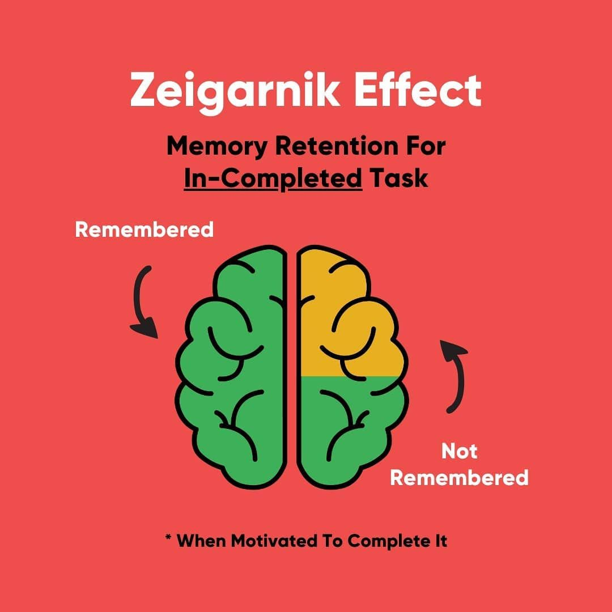

# Zeigarnik effect


Google AI generated


<figure><figcaption>
<a href="https://www.vallabhchitnis.com/product-management/unfinished-tasks-user-engagement-with-the-zeigarnik-effect/">https://www.vallabhchitnis.com/product-management/unfinished-tasks-user-engagement-with-the-zeigarnik-effect/</a>
</figcaption></figure>

> The Zeigarnik Effect is the psychological phenomenon where people remember unfinished or interrupted tasks better than tasks that have been completed. Named after Lithuanian-Soviet psychologist [Bluma Zeigarnik](https://www.google.com/search?sca_esv=24998f3a4070201e\&rlz=1C5CHFA_enSG951SG953\&sxsrf=AE3TifMfEcNYl-YnEAKy3ujl_nirzJREaA%3A1756731483874\&q=Bluma+Zeigarnik\&sa=X\&sqi=2\&ved=2ahUKEwjukL_gzrePAxW2i2MGHYc-B0wQxccNegQIQRAB\&mstk=AUtExfBv93zfwHF2davFHi7qQ4jommc7N--l9Aj_vzOV79JsyWFbMyvRdOvZtR7UyIM2HlRmbrBhEkgCYZysdWL-FyqhjyK2uViHNh7R4wCmRezSb6j7T3vEhfH_3paaNJ_DOT0lixKCYeW-tPYCfk0DytK5HauQYxK_BrTCsEH84VfcDZKXGnD388W7XTver4DC4RFzn9w8c1ZeSKrqaL0omXYxHc_-iTlXDdmb8qNn4zWMTB4AAOp7zciccwo3kp-mngtPMPEND_K8_npeOgnxIhBU\&csui=3), this effect occurs because unfinished tasks create a cognitive "open loop" that holds our attention, requiring mental energy and making them more accessible in memory until the task is resolved. It's why people might keep thinking about an unfinished project or be captivated by cliffhangers, and it can be intentionally used to boost creativity and productivity.
>
> * **Cognitive Burden**:An unfinished task creates a cognitive load that keeps it active in your mind, a mental "to-do list" that needs to be checked off.
> * **Goal-Driven Behavior**:The brain is goal-oriented and strives to resolve the tension or psychological unease caused by an unresolved task by keeping it in focus.
> * **Memory & Attention**:Because the task is incomplete, it demands more mental resources and attention, making it easier to recall later.
>
> Origin of the Concept&#x20;
>
> * **Observing Waiters**:Bluma Zeigarnik first observed this effect in the 1920s while in a restaurant, noticing that waiters could easily recall complicated, unpaid orders but forgot them once they were completed.
> * **Scientific Study**:She then conducted lab experiments where participants were interrupted during simple tasks, and found they were much more likely to remember the interrupted tasks than those they completed.
>
> Applications
>
> * **Creativity and Idea Generation**:By starting a project and pausing, you allow your subconscious to keep working on it, which can lead to new ideas.&#x20;
> * **Boosting Productivity**:You can use the effect to your advantage by simply starting a task; the "open loop" created will provide the momentum to complete it.&#x20;
> * **Media and Marketing**:Industries use the Zeigarnik Effect to create engaging content, such as:&#x20;
>   * **News**: Using teasers and incomplete headlines.&#x20;
>   * **TV and Movies**: Employing cliffhangers to keep viewers watching.&#x20;
>   * **Marketing**: Creating click-inducing ads.&#x20;



This video explains the Zeigarnik Effect in detail, including how it works and how to use it&#x20;
