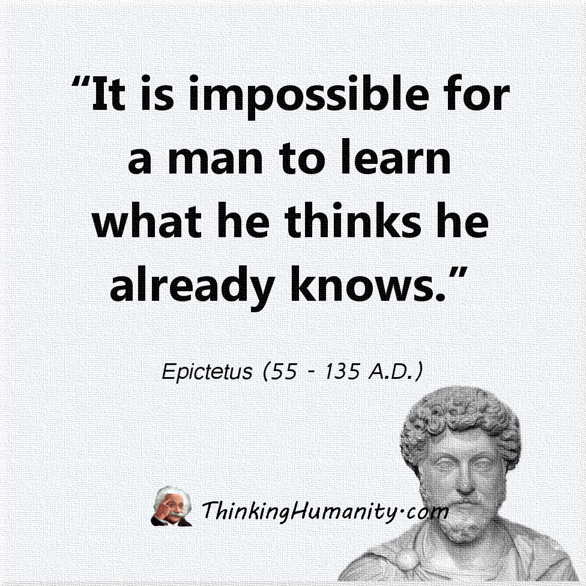

# Is Disengagement the Problem? Why Ownership is the Solution

In a hierarchy of professional traits, I am arguing that Ownership is the leading indicator.

* **Responsibility** is a lagging indicator (you did the task because you were told).
* **Accountability** is a lagging indicator (you are answering for what already happened).
* **Ownership** is the only one that happens _before_ the work begins. Without it, the "engine" of the team stays in neutral—which is the definition of Disengagement.

| **Concept**        | **Definition in a Nutshell**                                      | **Internal vs. External**  |
| ------------------ | ----------------------------------------------------------------- | -------------------------- |
| **Responsibility** | The obligation to perform a specific task or duty.                | External (Assigned to you) |
| **Accountability** | Answering for the results (good or bad) after the fact.           | External (Owed to others)  |
| **Ownership**      | The mental state of feeling 100% committed to the end goal.       | **Internal (Self-driven)** |
| **Stewardship**    | Caring for something you don't own for the benefit of the future. | Internal/**Altruistic**    |
| **Leadership**     | Influencing and empowering others to achieve a collective goal.   | Relational                 |

#### Is Ownership Central to All?

Yes, you absolutely can say that. Ownership is the "glue" because it transforms a passive participant into a proactive driver.

* **Ownership** + **Responsibility**: Without ownership, responsibility is just "doing what I'm told." With ownership, you don't just do the task; you ensure the task actually _works_.
* **Ownership** + **Accountability**: Without ownership, accountability feels like blame. With ownership, you _want_ to be held accountable because you take pride in the result.
* **Ownership** + **Stewardship**: Stewardship is essentially "temporary ownership." You treat the company or the environment as if it were your own property, ensuring it's better when you leave than when you found it.
* **Ownership** + **Leadership**: You cannot lead people toward a vision you don't personally own. True leaders take ownership of failures and give away ownership of successes.

#### The Nuance of Stewardship

The only place where Ownership gets tricky is in **Stewardship**. In a literal sense, a steward _doesn't_ own the assets (like a non-profit director or a forest ranger). However, the _mindset_ of ownership is exactly what makes a great steward. They act with the same level of care as an owner would, but with the humility to know they are serving a higher cause.

> **The "Rental Car" Analogy:** You have the **responsibility** to drive a rental car safely. You are **accountable** for any dents. But you rarely have **ownership**—which is why people rarely wash a rental car before returning it. **Stewardship** is washing that car anyway because you care about the next person who uses it.

Depending on the context—whether you’re describing a workplace culture, a personality trait, or a specific behavior—the "perfect" word for a lack of ownership changes.

Here are the best options categorized by the "vibe" they carry:

#### 1. The Professional Term: "Passivity"

If someone lacks ownership, they usually wait to be told what to do. They are reactive rather than proactive.

* **The Vibe:** They are a passenger, not the driver.
* **Context:** "The project failed due to team **passivity**; no one stepped up to fix the bugs."

#### 2. The Behavioral Term: "Disengagement"

This is the "quiet quitting" of ownership. The person does the bare minimum to avoid getting fired but has zero emotional or intellectual skin in the game.

* **The Vibe:** They simply don't care about the outcome.
* **Context:** "We are seeing a high level of **disengagement** in the regional branch."

#### 3. The Psychological Term: "External Locus of Control"

This is a bit more academic. It describes someone who believes that what happens to them is the result of outside forces (luck, fate, or "the boss") rather than their own actions.

* **The Vibe**: "It's not my fault, it's just how things are."
* **Context**: "His **external locus of control** prevents him from taking the lead on difficult tasks."

#### 4. The "Blame Game" Term: "Defensiveness"

When things go wrong, a person without ownership immediately looks for an exit strategy or someone else to point at.

* **The Vibe**: Protecting oneself is more important than solving the problem.
* **Context**: "His constant **defensiveness** makes it impossible to conduct a proper post-mortem."

#### 5. The "I'm Just Following Orders" Term: "Compliance"

This is a "dangerous" kind of lack of ownership. The person does exactly what they are told—even if they know it’s wrong—because they don't feel it's their job to think.

* **The Vibe**: "I just work here."
* **Context**: "Blind **compliance** is a symptom of a culture that lacks ownership."

| **Word**             | **Why it lacks ownership**                          |
| -------------------- | --------------------------------------------------- |
| **Apathy**           | They don't care enough to own it.                   |
| **Avoidance**        | They are actively dodging the "weight" of the task. |
| **Detachment**       | They feel no connection to the success or failure.  |
| **Irresponsibility** | They were given the task but failed to uphold it.   |
| **Bystander Effect** | They assume someone else will take ownership.       |

| **If you want to sound...** | **Try this heading...**                            |
| --------------------------- | -------------------------------------------------- |
| **Authoritative**           | "Ownership: The Core of Accountability"            |
| **Inspirational**           | "The Ownership Mindset: The Foundation of Success" |
| **Philosophical**           | "Ownership as the Root of Leadership"              |
| **Action-Oriented**         | "Driving Results Through Total Ownership"          |
| **Direct**                  | "Why Ownership Must Come First"                    |

<figure><figcaption>
<a href="https://share.google/aimode/5UCzd0rmZfhhD9OuJ">https://share.google/aimode/5UCzd0rmZfhhD9OuJ</a>
</figcaption></figure>

<figure><figcaption>
<a href="https://share.google/aimode/uV23L64YaD7tfTT4H">https://share.google/aimode/uV23L64YaD7tfTT4H</a>
</figcaption></figure>

<figure><figcaption>
<a href="https://share.google/aimode/XGFH8AegvChbSovpB">https://share.google/aimode/XGFH8AegvChbSovpB</a>
</figcaption></figure>

***


I'll read the article and then provide a critique.## Critique of "Is Disengagement the Problem? Why Ownership is the Solution"

This article presents an interesting framework for understanding workplace motivation and performance, but it has several strengths and weaknesses worth examining.

#### Strengths

**Clear conceptual framework**: The author does a good job distinguishing between responsibility, accountability, ownership, stewardship, and leadership. The table format makes these distinctions easy to grasp, and the internal vs. external dimension adds useful nuance.

**The leading/lagging indicator insight**: The argument that ownership is a leading indicator while responsibility and accountability are lagging indicators is genuinely valuable. This reframes the conversation from reactive problem-solving to proactive culture-building.

**Practical metaphors**: The rental car analogy effectively illustrates the difference between responsibility, accountability, and ownership in a relatable way that most readers will immediately understand.

**Taxonomy of disengagement**: The breakdown of different terms for lack of ownership (passivity, disengagement, external locus of control, etc.) is useful for managers trying to diagnose specific problems on their teams.

#### Weaknesses

**Oversimplification of causality**: The article presents ownership as _the_ solution to disengagement, but this is likely too simplistic. Disengagement often results from systemic issues—poor management, lack of resources, unclear direction, unfair compensation, toxic culture, or burnout. Simply telling people to "take ownership" doesn't address these root causes and can come across as blaming individuals for organizational failures.

**Lack of practical implementation**: The article identifies ownership as critical but provides almost no concrete guidance on how to cultivate it. How do you build ownership in a team? What organizational structures support it? What kills it? These questions remain unanswered.

**The stewardship confusion**: The author acknowledges that stewardship creates a conceptual problem for their framework (stewards don't literally own what they manage), then tries to resolve it by saying stewards have an "ownership mindset." This feels like circular reasoning—ownership is central to everything, including things that aren't ownership.

**Missing the power dynamics**: The framework assumes everyone _can_ take ownership, but in many organizational contexts, people who try to take ownership beyond their formal authority get shut down, punished, or told to "stay in their lane." The article doesn't address how hierarchy, politics, and power affect who gets to exercise ownership.

**Unrealistic expectations**: The statement that ownership means "feeling 100% committed to the end goal" sets an impossibly high bar. This level of commitment is neither sustainable nor appropriate for most work relationships, especially given that employees have limited control over strategy, resources, and decision-making.

**Cultural assumptions**: The emphasis on individual ownership reflects a particularly Western, individualistic workplace culture. In many contexts, collective responsibility and interdependence are valued over individual ownership.

**No evidence or research**: The article presents its framework as fact without citing any research, case studies, or data. It's essentially an opinion piece dressed up as analysis.

#### Missing Perspectives

The article would be stronger if it addressed when ownership is _not_ the answer—situations where systemic change, better processes, or resource allocation matter more than individual mindset. It also doesn't explore the dark side of excessive ownership, like burnout, inability to delegate, or toxic overwork cultures that exploit people's sense of ownership.

Overall, this is a thought-provoking framework that offers useful vocabulary for workplace discussions, but it needs more nuance, practical application, and acknowledgment of structural constraints to be truly valuable beyond a surface level.


***

## Revised by [Claude](https://claude.ai/share/f1dd069e-a5bd-42af-9653-333d5c34fa6e)&#x20;


## Is Disengagement the Problem? Why Ownership is the Solution

Think of it this way: Responsibility is the task, Accountability is the consequence, but Ownership is the spirit.

In a hierarchy of professional traits, I am arguing that Ownership is a critical leading indicator—though not the only factor that drives high-performing teams.

* **Responsibility** is a lagging indicator (you did the task because you were told).
* **Accountability** is a lagging indicator (you are answering for what already happened).
* **Ownership** is the only one that happens _before_ the work begins. Without it, the "engine" of the team stays in neutral—which is the definition of Disengagement.


| **Concept**        | **Definition in a Nutshell**                                                         | **Internal vs. External**  |
| ------------------ | ------------------------------------------------------------------------------------ | -------------------------- |
| **Responsibility** | The obligation to perform a specific task or duty.                                   | External (Assigned to you) |
| **Accountability** | Answering for the results (good or bad) after the fact.                              | External (Owed to others)  |
| **Ownership**      | The mental state of feeling committed to the end goal and empowered to influence it. | **Internal (Self-driven)** |
| **Stewardship**    | Caring for something you don't own for the benefit of the future.                    | Internal/**Altruistic**    |
| **Leadership**     | Influencing and empowering others to achieve a collective goal.                      | Relational                 |


### Is Ownership Central to All?

Ownership is a powerful "glue" because it transforms a passive participant into a proactive driver. However, it's important to recognize that ownership alone cannot compensate for systemic failures in organizational design, resources, or culture.

* **Ownership** + **Responsibility**: Without ownership, responsibility is just "doing what I'm told." With ownership, you don't just do the task; you ensure the task actually _works_.
* **Ownership** + **Accountability**: Without ownership, accountability feels like blame. With ownership, you _want_ to be held accountable because you take pride in the result.
* **Ownership** + **Stewardship**: Stewardship is essentially "temporary ownership." You treat the company or the environment as if it were your own property, ensuring it's better when you leave than when you found it.
* **Ownership** + **Leadership**: You cannot lead people toward a vision you don't personally own. True leaders take ownership of failures and give away ownership of successes.

### The Nuance of Stewardship

The only place where Ownership gets tricky is in **Stewardship**. In a literal sense, a steward _doesn't_ own the assets (like a non-profit director or a forest ranger). However, the _mindset_ of ownership is exactly what makes a great steward. They act with the same level of care as an owner would, but with the humility to know they are serving a higher cause.

> **The "Rental Car" Analogy:** You have the **responsibility** to drive a rental car safely. You are **accountable** for any dents. But you rarely have **ownership**—which is why people rarely wash a rental car before returning it. **Stewardship** is washing that car anyway because you care about the next person who uses it.

### Understanding the Absence of Ownership

Depending on the context—whether you're describing a workplace culture, a personality trait, or a specific behavior—the "perfect" word for a lack of ownership changes.

Here are the best options categorized by the "vibe" they carry:

#### 1. The Professional Term: "Passivity"

If someone lacks ownership, they usually wait to be told what to do. They are reactive rather than proactive.

* **The Vibe:** They are a passenger, not the driver.
* **Context:** "The project failed due to team **passivity**; no one stepped up to fix the bugs."

#### 2. The Behavioral Term: "Disengagement"

This is the "quiet quitting" of ownership. The person does the bare minimum to avoid getting fired but has zero emotional or intellectual skin in the game.

* **The Vibe:** They simply don't care about the outcome.
* **Context:** "We are seeing a high level of **disengagement** in the regional branch."

**Important Note:** Disengagement is often a symptom, not a root cause. Before attributing disengagement to individual lack of ownership, leaders should examine whether systemic issues are at play—poor management, lack of resources, unclear direction, unfair compensation, toxic culture, or burnout.

#### 3. The Psychological Term: "External Locus of Control"

This is a bit more academic. It describes someone who believes that what happens to them is the result of outside forces (luck, fate, or "the boss") rather than their own actions.

* **The Vibe**: "It's not my fault, it's just how things are."
* **Context**: "His **external locus of control** prevents him from taking the lead on difficult tasks."

#### 4. The "Blame Game" Term: "Defensiveness"

When things go wrong, a person without ownership immediately looks for an exit strategy or someone else to point at.

* **The Vibe**: Protecting oneself is more important than solving the problem.
* **Context**: "His constant **defensiveness** makes it impossible to conduct a proper post-mortem."

#### 5. The "I'm Just Following Orders" Term: "Compliance"

This is a "dangerous" kind of lack of ownership. The person does exactly what they are told—even if they know it's wrong—because they don't feel it's their job to think.

* **The Vibe**: "I just work here."
* **Context**: "Blind **compliance** is a symptom of a culture that lacks ownership."


| **Word**             | **Why it lacks ownership**                          |
| -------------------- | --------------------------------------------------- |
| **Apathy**           | They don't care enough to own it.                   |
| **Avoidance**        | They are actively dodging the "weight" of the task. |
| **Detachment**       | They feel no connection to the success or failure.  |
| **Irresponsibility** | They were given the task but failed to uphold it.   |
| **Bystander Effect** | They assume someone else will take ownership.       |


### How to Cultivate Ownership: Practical Strategies

Ownership cannot simply be demanded—it must be enabled and nurtured. Here are evidence-based approaches:

#### 1. **Grant Actual Authority, Not Just Responsibility**

People cannot take ownership if they lack the power to make meaningful decisions. Ensure that responsibility comes paired with appropriate autonomy, resources, and decision-making authority.

**Example:** Instead of "You're responsible for customer satisfaction," try "You have the authority to resolve customer issues up to $500 without approval."

#### 2. **Create Psychological Safety**

Research by Amy Edmondson shows that ownership thrives in environments where people can take risks, admit mistakes, and challenge the status quo without fear of punishment.

**Action:** Model vulnerability as a leader. When you make mistakes, own them publicly and focus on learning rather than blame.

#### 3. **Align Individual Goals with Organizational Goals**

People take ownership when they see how their work connects to meaningful outcomes. Make the "why" explicit and visible.

**Action:** Regularly connect individual tasks to broader team and organizational objectives. Help people see their impact.

#### 4. **Reduce Artificial Barriers**

Hierarchical structures, excessive approval processes, and territorial politics can kill ownership. People who try to "own" beyond their formal role often get shut down.

**Action:** Audit your processes. Are there unnecessary approval gates? Do people have the information and tools they need? Are politics preventing good ideas from surfacing?

#### 5. **Recognize and Reward Ownership Behaviors**

What gets recognized gets repeated. Explicitly celebrate examples of people going beyond their job description to drive results.

**Action:** In team meetings, highlight specific instances where someone demonstrated ownership, not just achievement.

#### 6. **Sustainable Commitment, Not Burnout**

Ownership does not mean 100% commitment at all times to every task. That's a recipe for burnout. Instead, foster an environment where people feel genuine investment in their core responsibilities while maintaining healthy boundaries.

**Action:** Model work-life balance as a leader. Make it clear that ownership is about quality of engagement, not quantity of hours.

### When Ownership Is Not Enough

It's critical to recognize when individual ownership cannot solve the problem:

#### Systemic Issues Requiring Organizational Change

* **Resource constraints**: No amount of ownership can compensate for inadequate budgets, tools, or staffing.
* **Poor strategy**: If the organizational direction is fundamentally flawed, individual ownership will lead to burnout, not success.
* **Toxic leadership**: In environments with blame cultures, political infighting, or incompetent management, encouraging ownership can actually harm employees.
* **Structural inequality**: When certain groups are systematically denied opportunities or authority, telling them to "take ownership" can be tone-deaf at best, harmful at worst.

#### The Dark Side of Excessive Ownership

* **Burnout**: When people feel personally responsible for everything, they sacrifice health and wellbeing.
* **Inability to delegate**: Over-identification with work can prevent effective team scaling.
* **Exploitation**: Organizations that rely on people's sense of ownership while failing to provide fair compensation, resources, or support create toxic environments.

#### Cultural Context Matters

The emphasis on individual ownership reflects Western, individualistic workplace culture. In many contexts around the world, collective responsibility, interdependence, and communal success are valued over individual ownership. Effective leaders adapt their approach to the cultural context in which they operate.

### Research and Evidence

While the framework presented here is conceptual, it aligns with established research:

* **Self-Determination Theory** (Deci & Ryan): Autonomy, competence, and relatedness are fundamental psychological needs that drive intrinsic motivation—the foundation of ownership.
* **Psychological Ownership** (Pierce, Kostova & Dirks): Research shows that psychological ownership increases when people have control, intimate knowledge, and investment in something.
* **Job Characteristics Model** (Hackman & Oldham): Task significance, autonomy, and feedback are key drivers of internal work motivation.

### Conclusion: Ownership as Necessary But Not Sufficient

Ownership is a powerful force multiplier in teams and organizations. It transforms compliance into commitment and passengers into drivers. However, it is not a silver bullet. Leaders must:

1. **Enable** ownership by providing authority, resources, and psychological safety
2. **Recognize** that absence of ownership is often a symptom of systemic problems
3. **Balance** individual ownership with collective responsibility
4. **Avoid** using ownership as an excuse to overwork or under-resource teams

When ownership is genuinely enabled—not just demanded—it becomes the foundation upon which responsibility, accountability, stewardship, and leadership can thrive.

***


| **If you want to sound...** | **Try this heading...**                            |
| --------------------------- | -------------------------------------------------- |
| **Authoritative**           | "Ownership: The Core of Accountability"            |
| **Inspirational**           | "The Ownership Mindset: The Foundation of Success" |
| **Philosophical**           | "Ownership as the Root of Leadership"              |
| **Action-Oriented**         | "Driving Results Through Total Ownership"          |
| **Direct**                  | "Why Ownership Must Come First"                    |
| **Nuanced**                 | "Ownership: Necessary But Not Sufficient"          |
