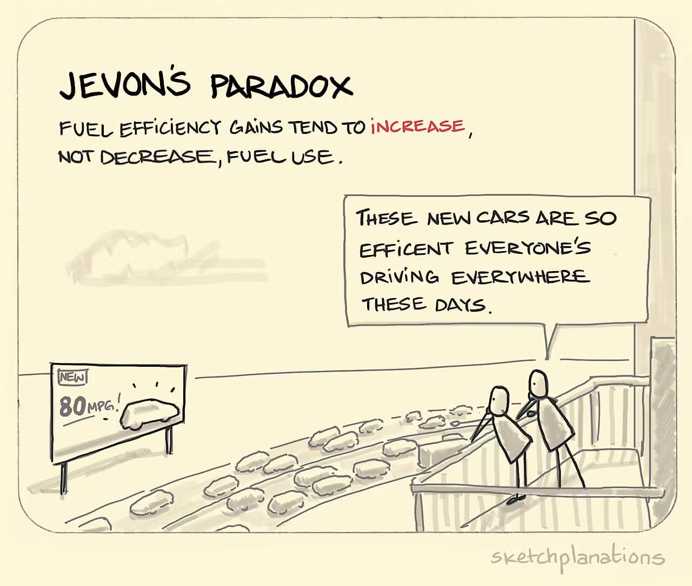

# Givers and Takers

### Givers and Takers

<figure><figcaption></figcaption></figure>

> #### Why do I highly value disagreeable givers?
>
> When I think of the _irreplaceable_ peers I’ve had over the years, what stands out to me is that every one of them regularly disagreed with me.
>
> [https://www.scarletink.com/i/154852048/why-do-i-highly-value-disagreeable-givers](https://www.scarletink.com/i/154852048/why-do-i-highly-value-disagreeable-givers)


